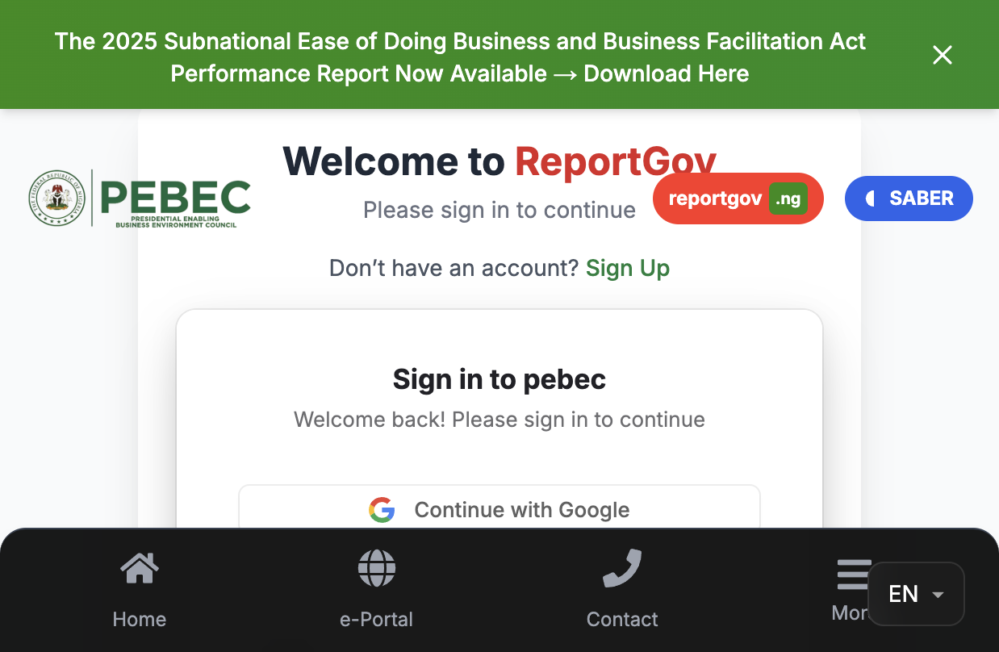

# SABER Agent Portal — Step-by-Step Tutorial Script

Use this script to walk SABER agents through the PEBEC portal menu by menu.  
**Portal URL (after login):** `https://www.pebec.gov.ng/saber_agent`  
**Role required:** `saber_agent` (assigned to one **state**)

**Screenshots:** `docs/saber-agent-screenshots/` (see [README](./saber-agent-screenshots/README.md) for capture status)

---

## Before you start (facilitator notes)

- Agents must **sign in** with the email Clerk account PEBEC created for them.
- After login, they should open **`/saber_agent`** directly (bookmark it). The public homepage does not auto-redirect SABER agents.
- The **left sidebar** is labeled **“Saber Agent”**. On mobile, tap the **☰ menu** (top left) to open it.
- **Top bar:** PEBEC logo (home), **messages** icon, **notifications** bell.
- **Logout** is the red button at the bottom of the sidebar.

---

## Part 0 — Sign in and open the portal

**Say:**  
“Open the PEBEC website and sign in with your official email and password. Once you are in, go to **Saber Agent** — the address ends with `/saber_agent`. That is your workspace for your state.”

**Steps:**
1. Go to the site sign-in page.
2. Enter email and password → **Sign in**.
3. In the browser, go to **`/saber_agent`** (or use the link PEBEC sent you).
4. Confirm the left panel shows **Saber Agent** and your state appears on the dashboard.



---

## Part 1 — Dashboard

**Menu:** **Dashboard** (home icon) → `/saber_agent`

**Say:**  
“This is your home screen. It summarizes DLI activity for **your state** and recent work.”

**Walk through:**
1. **Active DLIs in [State]** — how many reform indicators (DLIs) are in progress or completed for your state.
2. **Generate My DLI Report** — click **Generate Report** to download a PDF summary of your state’s DLI progress (for meetings or records).
3. **DLI progress chart** — visual view of progress (if shown).
4. **Activity summary (last 30 days)** — count of **letters sent** and **reports submitted**.
5. **Check Out SABER Materials** — shortcut to documents; click **View Materials** (covered in Part 3).

**Practice:** Click **Generate Report** once and confirm the PDF downloads.


---

## Part 2 — Saber (folder menu)

**Menu:** **Saber** (grid icon) — expands to three items.

**Say:**  
“Everything about the SABER program itself lives under **Saber**: DLIs, public overview, and shared materials.”

---

### 2A — DLIs

**Menu:** **Saber → DLIs** → `/saber_agent/dli`

**Say:**  
“DLIs are the reform deliverables your state must complete. This page lists every DLI template and your progress.”

**First visit — Eligibility Criteria (EC):**  
If a popup appears (**SABER Eligibility Criteria**), the agent must **tick all five checkboxes** (2026 BERAP / planning commitments), then confirm. This is required once before scoring fairly.

**Walk through each DLI card:**
1. Read the DLI **title** and short description.
2. Check **status**: not started, in progress, or completed.
3. **Start** (or **Continue**) — opens a setup step list, then the DLI workspace.
4. Inside a DLI (`/saber_agent/dli/[id]`):
   - Complete **steps** in order (uploads, forms, confirmations as shown).
   - Use **Back** to return to the DLI list.
5. **BERAP Eligibility** DLI may open a special modal before steps — follow on-screen instructions.
6. When all steps are done, status should show **completed**.

**Practice:** Open one **in progress** DLI, complete one step, save, return to the list.


---

### 2B — Overview

**Menu:** **Saber → Overview** → `/saber_agent/saber-overview`

**Say:**  
“This is the **public SABER program page** — background on the $750M program, prior results, and how states participate. Use it to explain SABER to colleagues; you do not submit data here.”

**Walk through:**
- Scroll through program description, financing, and reform areas.
- Note links to **events** and **materials** on the public view (reference only).


---

### 2C — Materials

**Menu:** **Saber → Materials** → `/saber_agent/materials`

**Say:**  
“Here you download **guides, templates, and official documents** shared with SABER agents. Files are shown as cards — title, description, and **Download**.”

**Walk through:**
1. Browse available materials (filtered to what your role can see).
2. Click **Download** on a file you need for a DLI or report.
3. **Admins** may see **+ Add Material** — SABER agents normally **only download**, not upload.

**Practice:** Download one material and confirm it opens or saves.


---

## Part 3 — Submit Report

**Menu:** **Submit Report** (document icon) → `/saber_agent/reports`

**Say:**  
“This is where you **submit structured SABER agent reports** as PDFs. Choose the **DLI category**, then the **report type**, fill the form, and submit.”

**Walk through:**
1. At the top, pick a **DLI tab** (buttons):
   - **DLI-4**
   - **DLI-5**
   - **DLI-6**
   - **DLI-8**
   - **ELIGIBILITY CRITERIA (BERAP)**
2. Under **Select Report Type**, choose the template for that DLI (examples below).
3. Complete all required fields in the form (varies by type — links, yes/no, uploads, tables).
4. Click **Submit** (or equivalent) — the system generates a PDF and stores your submission.
5. Scroll down to **submitted reports** (if shown) — view status, download PDF/Excel.

**Report types by DLI (what agents select):**

| DLI tab | Report types |
|--------|----------------|
| **DLI-4** | State Investor Aftercare and Retention Program; Announce Investment; Inventory Incentive |
| **DLI-5** | Publication of Business Regulatory Processes (5 BEE MDAs); GRM Report; Monthly Compliance Report (5 MDAs) |
| **DLI-6** | Schedule of Trade-Related Fees Compliance; SCEP Report; GRM Report |
| **DLI-8** | Certificate of Authentication (SCC reports); Certificate of Authentication (execution); SCC Execution Report (monthly); SCC Time to Disposition (monthly) |
| **BERAP** | BERAP / Eligibility guide (2026 cycle) |

**Say:**  
“Always match the report type to what PEBEC asked for this month. If unsure, check **Materials** or ask your state lead.”

**Practice:** Select **DLI-4** → one report type → fill mandatory fields → submit (use test data only if in training).


---

## Part 4 — DMO Report

**Menu:** **DMO Report** → `/saber_agent/dmo-report`

**Say:**  
“This is a **separate, short form** for the Debt Management Office (DMO) track: whether your state published the DSA/DMS link on the state website.”

**Walk through:**
1. Confirm **State** shown at the top matches your assignment.
2. Note **deadline** (if displayed).
3. Answer: **Has the link been published on your state website?** → **Yes** or **No**.
4. If **Yes**:
   - Enter **Web link** (full URL).
   - Enter **Date published**.
5. Click **Submit**.
6. If already submitted, the form may show your previous answers and any **DMO Assessment** (met / not met).

**Practice:** Review fields; submit only when the state website is actually live.


---

## Part 5 — Send a Letter / Files

**Menu:** **Send a Letter/Files** → `/saber_agent/send-letters`

**Say:**  
“Use this to **send official letters or PDFs** to PEBEC staff who work on SABER. You can track what you sent and download copies.”

**Walk through — list page:**
1. Table: **Letter name**, **Date sent**, **Sent to**, **Status**, **Actions**.
2. **View** — open letter details.
3. **Download** — save the attachment.
4. Status examples: **Sent**, **Acknowledged**, **In progress**, **Resolved**.

**Send a new letter:**
1. Click **Send New Letter to PEBEC**.
2. In the popup:
   - **Letter subject** (required).
   - **Select Staff** — pick a PEBEC staff member with SABER access (dropdown lists eligible staff only).
   - **Description** (optional).
   - **Attach file** (optional, max **5 MB**): choose file → **Upload** → wait for success.
3. Click **Submit letter**.
4. Close popup; confirm the new row appears in the table.

**Say:**  
“You can only send to **staff on the SABER team**, not random users. If someone is missing, ask PEBEC admin to grant SABER permissions.”

**Practice:** Send a test letter with a small PDF during training (or walk through without submitting in live session).


---

## Part 6 — Received Letters

**Menu:** **Received Letters** (inbox icon) → `/saber_agent/received-letters`

**Say:**  
“Letters **sent to you** from PEBEC or other users appear here — the opposite of Send.”

**Walk through:**
1. Use **search** and filters (role, sender, status, date range) to find items.
2. Table: sender, subject, date, status.
3. **View** — read full letter and attachment.
4. **Update status** (if shown) — e.g. acknowledge or mark resolved.
5. **Refresh** if you expect a new letter.

**Practice:** Open one received letter and walk through View + status update.


---

## Part 7 — Profile

**Menu:** **Profile** → `/saber_agent/profile`

**Say:**  
“Keep your **name, email, phone, and state** correct. Some fields may be read-only if set by PEBEC admin.”

**Walk through:**
1. Review personal details.
2. Update allowed fields (photo, contact info — per what the form allows).
3. Save changes.
4. Confirm **state** matches your SABER assignment (critical for DLIs and reports).

**Practice:** Open profile and verify state name.


---

## Part 8 — Messages and notifications (top bar)

**Not in sidebar — top of screen**

**Say:**  
“Two icons sit next to the logo: **messages** and **notifications**.”

**Messages:**
- Click the messages icon for internal PEBEC messaging (if enabled for your account).

**Notifications:**
- Click the bell for alerts (assignments, letter updates, system notices).
- Open an item to see detail; mark read as you go.

**Practice:** Open each once and explain what a typical alert means.

---

## Part 9 — Recommended weekly routine (close the session)

**Say:**

| When | Action |
|------|--------|
| **Daily** | Check **notifications** and **Received Letters**. |
| **Weekly** | Update **DLIs** (steps in progress). |
| **As required** | **Submit Report** for the DLI/report type PEBEC requested. |
| **As required** | **DMO Report** before the published deadline. |
| **When communicating** | **Send a Letter/Files** with evidence. |
| **When unsure** | **Materials** + **Overview** for reference. |
| **Monthly** | **Dashboard → Generate Report** for state summary. |

---

## Troubleshooting (quick answers)

| Problem | What to try |
|--------|-------------|
| “Access denied” on `/saber_agent` | Wrong role on account — contact PEBEC admin. |
| Empty **Select Staff** when sending letter | No staff with SABER permissions — contact admin. |
| DLI won’t start | Complete **Eligibility Criteria** popup first (all 5 boxes). |
| File upload fails | File must be **≤ 5 MB**; try PDF. |
| Report submit fails | Fill all required fields; check internet; retry. |
| Wrong state on forms | Fix **Profile** state with admin if locked. |

---

## Menu map (one-page cheat sheet)

```
Saber Agent Portal
├── Dashboard          → Summary, DLI count, activity, materials shortcut
├── Saber
│   ├── DLIs           → Start/continue reforms, steps, EC modal
│   ├── Overview       → Program info (read-only)
│   └── Materials      → Download guides & templates
├── Submit Report      → DLI-4/5/6/8/BERAP structured reports
├── DMO Report         → State website DSA/DMS link (yes/no + URL)
├── Send a Letter/Files→ Outbox + send to PEBEC SABER staff
├── Received Letters   → Inbox + status updates
└── Profile            → Your details & state
```

---

*Source: `app/(site)/saber_agent/*`, `components/ReformChampions/ReformChampionSidebar.tsx`. Update this script when menus or flows change.*
